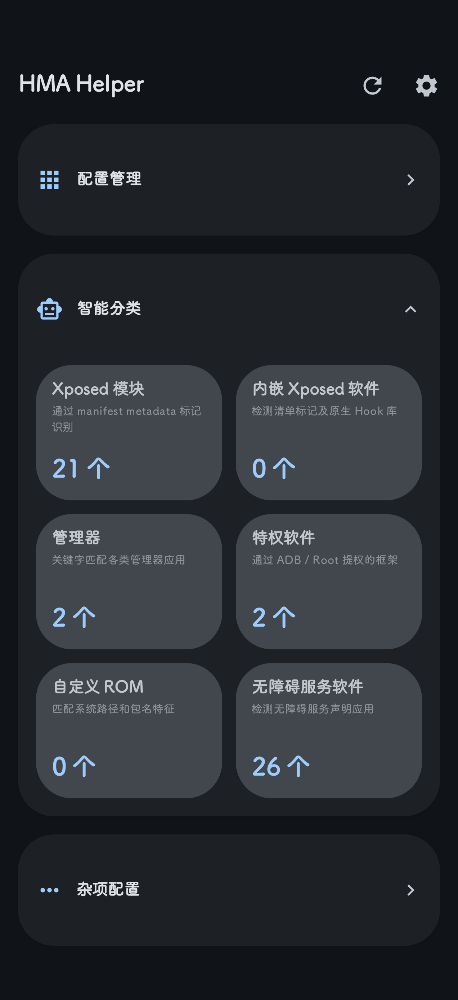
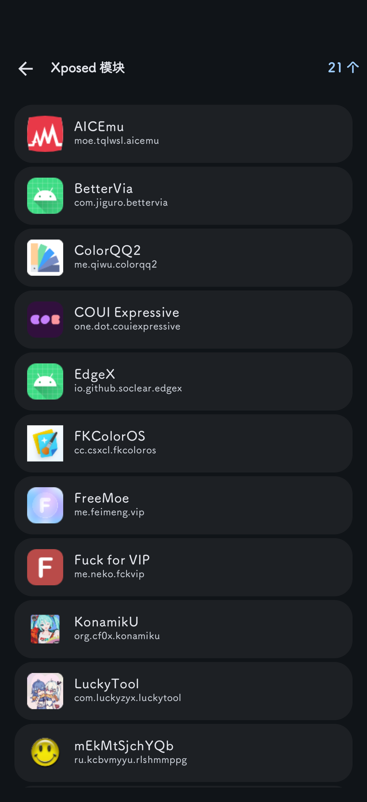
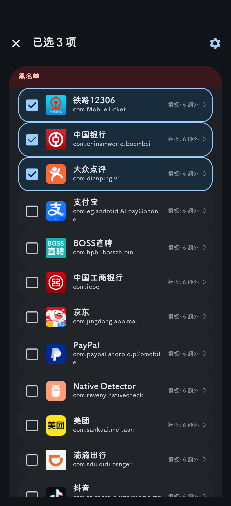

# HMA Helper

A companion tool for **[Hide My Applist (HMA)](https://github.com/Dr-TSNG/Hide-My-Applist)** — scan apps, classify them into presets, configure hiding scopes and templates, then **export as a JSON config** that HMA imports directly. No manual editing needed.

## Features

### 🔍 Smart Classification
Automatically scans installed apps and classifies them into 6 preset categories:

| Category | Detection Method |
|---|---|
| **Xposed Modules** | Manifest metadata identification |
| **Embedded Xposed** | Manifest marks & native hook libraries |
| **Managers** | Keyword-matched manager applications |
| **Privileged Apps** | Apps with ADB / Root elevation |
| **Custom ROM** | System path & package name fingerprint |
| **Accessibility Services** | Apps declaring accessibility services |

Each preset uses **multi-path package scanning** (`pm list packages`, `getInstalledApplications`, `getInstalledPackages`, Intent queries) to bypass common hooking attempts.

### 📋 Scope/Misc Configuration
Same As **[Hide My Applist (HMA)](https://github.com/Dr-TSNG/Hide-My-Applist)**

### 📦 Template System
- **Smart Classification templates** — Built-in, auto-populated from detected app lists

### 🔄 Import / Export
- Export full configuration as JSON (SAF or quick export)
- Import configurations from JSON files, support 
- Automatic cleanup of scope entries for uninstalled apps

## Screenshots

<table>
  <tr>
    <td></td>
    <td></td>
    <td></td>
  </tr>
</table>

## Download

[Releases](https://github.com/C-F0x/HMAHelper/releases)

## Requirements

- **Android 6.0+** (API 23)
- **Hide My Applist** installed ([GitHub](https://github.com/Dr-TSNG/Hide-My-Applist))

## Building

```bash
# Debug build
./gradlew assembleDebug

# Release build
./gradlew assembleRelease
```

The APK will be at `app/build/outputs/apk/debug/` or `app/build/outputs/apk/release/`.

## Tech Stack

| Component | Library |
|---|---|
| **UI** | Jetpack Compose (BOM 2026.02.01) |
| **Navigation** | Navigation Compose 2.8.5 |
| **State / ViewModel** | AndroidX Lifecycle + ViewModel |
| **Persistence** | DataStore Preferences |
| **Theming** | material-kolor 4.1.1 |
| **Min SDK / Target** | 23 / 28 |
| **Build** | Gradle + AGP 9.4.0-alpha05 + Kotlin 2.2.10 |

## License

[MIT](LICENSE)
