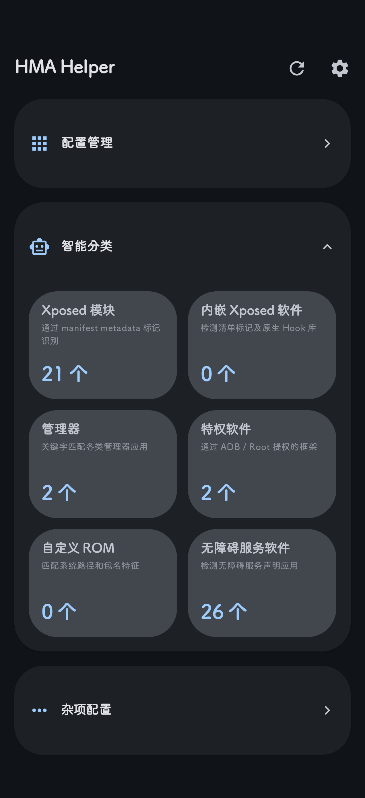
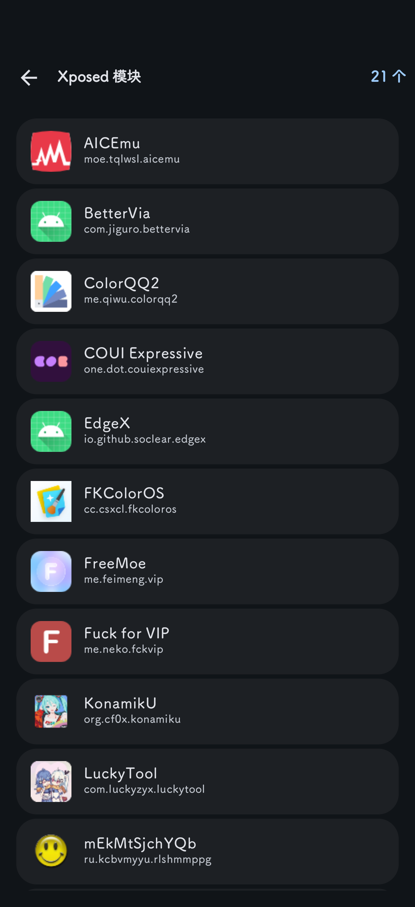
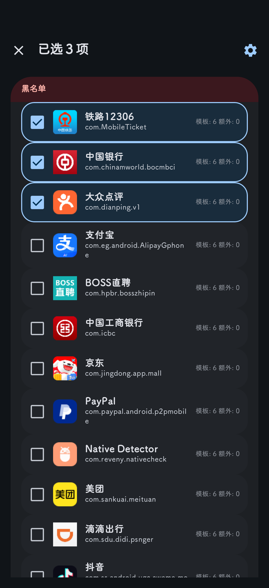

# HMA Helper

A companion tool for **[Hide My Applist (HMA)](https://github.com/Dr-TSNG/Hide-My-Applist)** — scan apps, classify them into presets, configure hiding scopes and templates, then **push the config straight into HMA** — either by exporting a JSON file, or with root privileges by writing HMA's own `config.json` directly.

## Features

### 🔍 Smart Classification
Automatically scans installed apps and classifies them into 6 preset categories:

| Category | Detection Method |
|---|---|
| **Xposed Modules** | Manifest metadata + libxposed provider detection |
| **Embedded Xposed** | Manifest marks & native hook libraries |
| **Managers** | Keyword-matched manager applications |
| **Privileged Apps** | Apps with ADB / Root elevation |
| **Custom ROM** | System path & package name fingerprint |
| **Accessibility Services** | Apps declaring accessibility services |

Each preset uses **multi-path package scanning** (`pm list packages`, `getInstalledApplications`, `getInstalledPackages`, Intent queries) to bypass common hooking attempts. With root access, scanning is upgraded to `pm list packages -f` + `dumpsys package` — immune to package visibility restrictions on newer Android versions, and it also catches **libxposed (next-gen)** modules that declare a `XposedProvider` instead of legacy meta-data.

### 🛡️ Root Mode (automatic)
No manual mode switch — when root is available, these features activate automatically:

- **Root-powered smart scanning** — full package enumeration + per-package meta-data / accessibility / overlay facts via root, immune to hooks and package visibility.
- **HMA config takeover** — toggle *Manage HMA Config* in Settings to read/write HMA's own `/data/data/com.tsng.hidemyapplist/files/config.json` directly through root. Every scope/template change (including batch edits) is pushed automatically; the refresh button force-rewrites it unconditionally.
- **Restart HMA with one tap** — after a push, a dialog offers to force-stop & relaunch Hide My Applist via root so the new config takes effect (HMA doesn't hot-reload).
- **Change toasts** — `Added/Removed/Modified scope <package|N apps>` and `Added/Removed/Modified template <name>` are shown on any screen, plus PID info when restarting HMA.
- **RRO overlay filter** — system resource overlays (`o.*` / `rg.*` style packages) never pollute the classification.

> Without root, everything still works through normal export/import.

### 📋 Scope / Misc Configuration
Per-app hiding scopes mirroring HMA's own format:

- **Work Mode** — blacklist / whitelist
- **Exclude System Apps** — whitelist only
- **Aggressive Intent Filter**
- **Templates** — smart-classification presets or custom templates
- **Extra App List** — additional packages
- **Batch editing** — long-press multi-select in the scope list, then edit work mode / filter / templates / extra apps for all selected apps at once (batch delete included)
- **Misc fields** — `configVersion`, `detailLog`, `maxLogSize`, `forceMountData`, `aggressiveFilter`

### 📦 Template System
- **Smart Classification templates** — built-in, auto-populated from detected app lists
- **Custom templates** — create your own with a curated app list
- Templates are filtered by the current work mode; deleting/renaming a template keeps scope references in sync

### 🔄 Import / Export
- Export full configuration as JSON (SAF or quick export)
- Import from JSON files — atomic replace, cross-language template names remapped, invalid entries skipped
- Automatic cleanup of scope entries for uninstalled apps

## Screenshots

<table>
  <tr>
    <td></td>
    <td></td>
    <td></td>
  </tr>
</table>

## Download

[Releases](https://github.com/C-F0x/HMAHelper/releases)

## Requirements

- **Android 6.0+** (API 23)
- **Hide My Applist** installed ([GitHub](https://github.com/Dr-TSNG/Hide-My-Applist))
- **Root** (Magisk / KernelSU / APatch) — only needed for root scanning & HMA config takeover

## Building

```bash
# Debug build
./gradlew assembleDebug

# Release build
./gradlew assembleRelease
```

The APK will be at `app/build/outputs/apk/debug/` or `app/build/outputs/apk/release/`.

## Tech Stack

| Component | Library |
|---|---|
| **UI** | Jetpack Compose (BOM 2026.02.01) |
| **Navigation** | Navigation Compose 2.8.5 |
| **State / ViewModel** | AndroidX Lifecycle + ViewModel |
| **Persistence** | DataStore Preferences |
| **Theming** | material-kolor 4.1.1 |
| **Min SDK / Target** | 23 / 28 |
| **Build** | Gradle + AGP 9.4.0-alpha05 + Kotlin 2.2.10 |

## License

[MIT](LICENSE)
